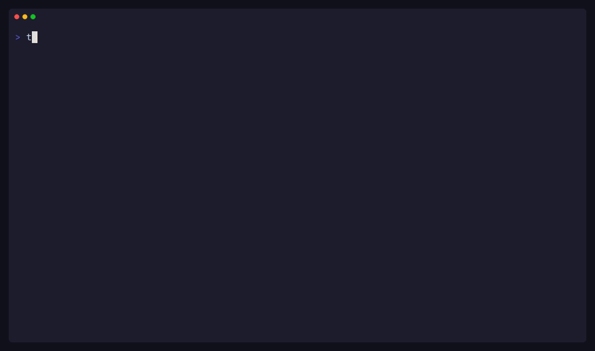
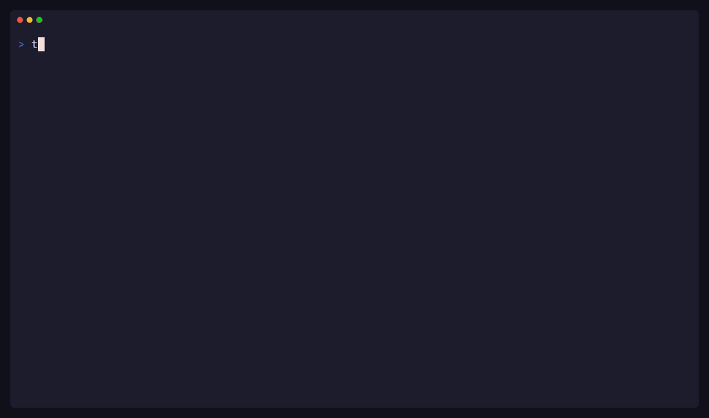

# Dewey

A TUI task manager that lives in your [Waybar](https://github.com/Alexays/Waybar/). Pull tasks from multiple sources into one view. Single Rust binary. Compatible with [Omarchy](https://github.com/basecamp/omarchy).

- Aggregate tasks from local files, [Obsidian](https://publish.obsidian.md/tasks/Introduction) vaults, and [Linear](https://linear.app)
- Smart Waybar badge and tooltip — task count at a glance, TUI a click away
- Quick-add with natural language — priorities, due dates, tags, backend routing
- Live config reload — toggle backends, switch themes, no restart needed
- Dark, light, and dynamic Omarchy theme support

---

### TUI


Navigate, quick-add, edit, and complete tasks without leaving the terminal. Tasks from all backends sorted by urgency.

### Waybar


Smart badge shows the most urgent count. Tooltip groups tasks by date with source icons.

### Backend aggregation



Toggle backends on and off in the config — tasks appear and disappear live.

### Live theme switching



Themes reload instantly when config changes.

---

## Install

```bash
curl -fsSL https://github.com/keyfer/dewey/raw/main/install.sh | bash
```

Or build from source:

```bash
cargo install --path .
```

## Quick start

```bash
mkdir -p ~/.config/dewey
curl -fsSL https://github.com/keyfer/dewey/raw/main/config.example.toml \
  -o ~/.config/dewey/config.toml
dewey add "Review PR today (p1)"
dewey add "Buy groceries tomorrow #errands"
dewey tui
```

## Backends

### Local file

Reads and writes `~/.dewey/todo.txt` by default.

```toml
[backends.local]
enabled = true
# path = "~/.dewey/todo.txt"
```

### Obsidian

Scans your vault for markdown checkboxes. Supports [Obsidian Tasks](https://publish.obsidian.md/tasks/Introduction) emoji metadata. Changes in the vault auto-refresh the TUI. Press `o` to open a task in Obsidian or `$EDITOR`.

```toml
[backends.obsidian]
enabled = true
vault_path = "~/Documents/Obsidian"
ignore_folders = [".obsidian", ".trash"]
inbox_file = "Inbox.md"
```

### Linear

Syncs issues from your [Linear](https://linear.app) workspace. Issues show up alongside your other tasks, and you can complete, edit, or create them directly from the TUI.

**Setup via the TUI wizard (recommended):**

1. Add the backend to your config (`~/.config/dewey/config.toml`):

   ```toml
   [backends.linear]
   enabled = true
   ```

2. Run `dewey tui` and press `L` to launch the setup wizard. It will walk you through:
   - Pasting your [Linear API key](https://linear.app/settings/api) (personal key starting with `lin_api_`)
   - Selecting your team
   - Choosing which team member's issues to show (or "me" for your own)
   - Picking which workflow statuses to display (e.g. Todo, In Progress, Backlog)

The wizard writes the full config for you. The result looks like:

```toml
[backends.linear]
enabled = true
api_key = "lin_api_..."
team_id = "..."
team_name = "Engineering"
assignee = "me"
user_id = "..."
filter_status = ["In Progress", "Todo", "Backlog"]
```

**Multiple Linear workspaces:** You can connect more than one team by running the wizard again (`L`). Each gets its own named section:

```toml
[backends.linear.work]
enabled = true
api_key = "lin_api_..."
team_id = "..."

[backends.linear.personal]
enabled = true
api_key = "lin_api_..."
team_id = "..."
```

## Waybar

```jsonc
"custom/tasks": {
    "exec": "dewey",
    "return-type": "json",
    "format": "{}",
    "on-click": "<your-terminal> -e dewey tui",
    "interval": 30,
    "tooltip": true
}
```

CSS classes: `has-overdue`, `has-tasks`, `all-done`, `backend-error`

## Configuration

`~/.config/dewey/config.toml` — changes are hot-reloaded. Press `c` in the TUI to edit. See [`config.example.toml`](config.example.toml) for all options.

## CLI

```
dewey              # TUI in terminal, Waybar JSON otherwise
dewey tui          # Force TUI mode
dewey add "..."    # Quick-add a task (supports natural language)
dewey list         # List today's tasks
dewey list all     # List all tasks
dewey list --format json  # JSON output for scripting
dewey config       # Print resolved config
dewey setup linear # Instructions for Linear setup
dewey agent status # Show running background agents
```

## TUI keybindings

| Key | Action |
|-----|--------|
| `j` / `k` | Navigate |
| `Enter` | View task detail |
| `a` | Quick-add task |
| `e` | Edit task |
| `x` | Toggle complete |
| `d` | Delete task |
| `o` | Open in source app / `$EDITOR` |
| `/` | Search |
| `Tab` / `S-Tab` | Jump between groups |
| `Space` | Collapse / expand group |
| `C` | Collapse / expand all groups |
| `r` | Refresh tasks |
| `c` | Open config in `$EDITOR` |
| `L` | Linear setup wizard |
| `A` | Launch AI agent |
| `S` | Agent status |
| `?` | Help |
| `q` | Quit |

## License

MIT
